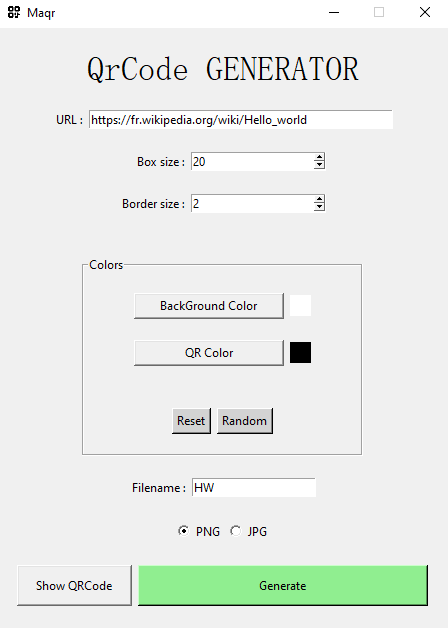
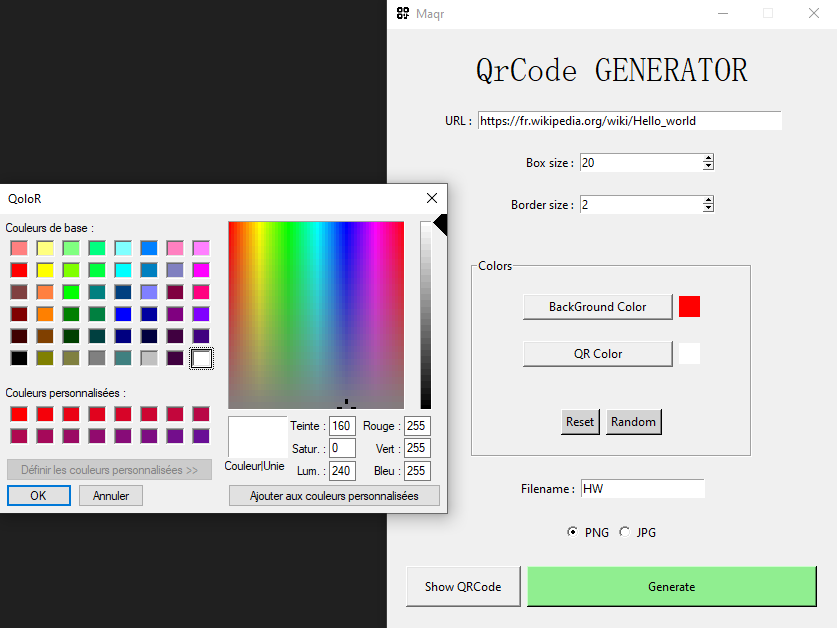

# Maqr
Free QR Code generator developped in python with [qrcode](https://pypi.org/project/qrcode/) Library.

## Author

* Name : Devos Yannis
* Email : yannisdevos@outlook.fr

## What's Maqr ?

Maqr is a small software that allows you to create QR Codes.
You can give it URL and customize it as you wish.

### Personalization

It's possible to change :

* QR size
    * Default : 20
* Border size
    * Default : 2
* Background color
    * Default : White
* QR Color
    * Default : Black

> QR and Border size can be changed up to 100.

### Others features

You can change QR's color randomly with `Random` and reset it with `Reset` buttons.

You have to enter an URL, a file name and choose between PNG or JPG to save your QR code, it will be saved into Maqr project folder.

It's possible to see the QR code without save him with `Show QRCode` button.





> :warning: **It is possible that colors that are too strong do not make the QR code work !**

## How to run

### Windows

To run the application on `Windows` you can :

* Directly run Maqr.py file with your IDE
* Run **Maqr.exe**

Or run this command in a terminal while in the project folder :

```
> python .\Maqr.py
```

### Linux

To run the application on `Linux` you can :

* Directly run Maqr.py file with your IDE
* Run **UnixMaqr.sh**

Or run this command in a terminal while in the project folder :

```
> python Maqr.py
```
