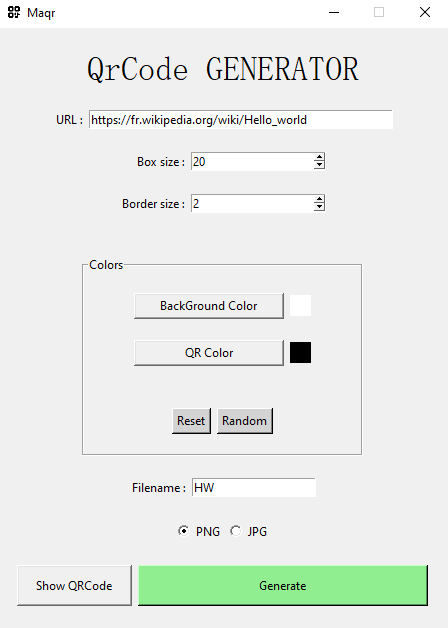
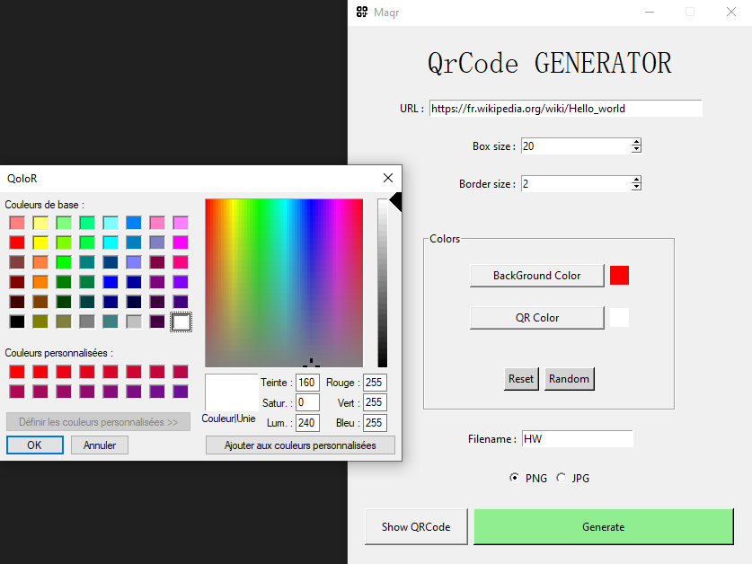

# Maqr

Free QR Code generator developped in python with [qrcode](https://pypi.org/project/qrcode/) Library.

## Author

- Name : Devos Yannis
- Email : yannisdevos@outlook.fr

## What's Maqr ?

Maqr is a small software that allows you to create QR Codes.
You can give it URL and customize it as you wish.

**QrCodes generated using Maqr will never expire.**

### Personalization

It's possible to change :

- QR size
  - Default : 20
- Border size
  - Default : 2
- Background color
  - Default : White
- QR Color
  - Default : Black

> QR and Border size can be changed up to 100.

### Others features

You can change QR's color randomly using `Random` and reset it with `Reset` buttons.

You have to enter an URL, a file name and choose between PNG or JPG to save your QR code, it will be saved into `qrcodes` directory.

It's possible to see the QR code without saving it thanks to the `Show QRCode` button.





> :warning: **It is possible that colors that are too strong do not make the QR code work !**

## How to run

Go to `main` directory and run main.py `OR` run Maqr.bat (**Windows**) / Maqr.sh (**Linux**).

You can also run it with your terminal using :

```
> python main.py
```
